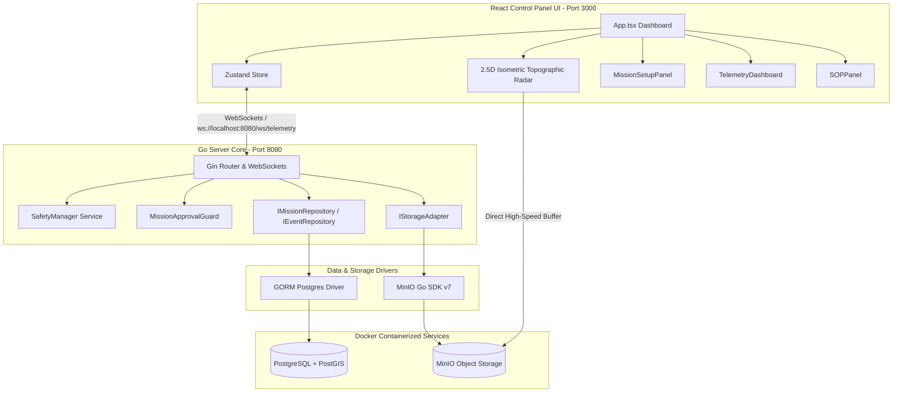

# Walkthrough — Control Center Stack Migration

> [!IMPORTANT]
> This is a summary of achievements. Refer to the root [Universal AI Guidelines](../../AGENT_GUIDELINES.md) and check completed steps in [task.md](./task.md).
재난 구조용 사족로봇 시스템 관제 센터의 기존 Python 모노리스 아키텍처를 **Go Server Core, React + TS Dashboard UI, PostgreSQL, MinIO** 기술 스택으로 안전하고 완벽하게 현대화 이식하였습니다.

이 문서는 개편 완료된 아키텍처 구조, 새로 생성된 파일 링크, 그리고 다중 노트북 환경에서의 개발 연속성 유지 방법에 대한 상세 보고서입니다.

---

## 1. 개편 완료된 시스템 아키텍처 (Modernized Architecture)



---

## 2. 새로 작성 및 개편된 핵심 컴포넌트 목록 (Key Artifacts)

### 1) Go Backend Infrastructure & Repositories
- [main.go](file:///c:/Users/cosmo/AI_challange/go_core/cmd/server/main.go): Gin REST API 라우터, CORS 헤더 설정, Gorilla WebSocket 브로드캐스트 게이트웨이 및 임무 가드를 관장하는 서버의 메인 진입점.
- [repositories.go](file:///c:/Users/cosmo/AI_challange/go_core/internal/ports/repositories.go): GORM PostgreSQL에 의존하지 않는 순수 인터페이스 포트.
- [storage.go](file:///c:/Users/cosmo/AI_challange/go_core/internal/ports/storage.go): 비디오/오디오 스트리밍을 위한 `UploadObject` 및 `GetPresignedURL` 기능을 추상화하는 스토리지 인터페이스.
- [event_repository.go](file:///c:/Users/cosmo/AI_challange/go_core/internal/adapters/postgres/event_repository.go): BaseEvent의 JSON 페이로드 직렬화 저장 및 쿼리용 GORM PostgreSQL 구현체.
- [mission_repository.go](file:///c:/Users/cosmo/AI_challange/go_core/internal/adapters/postgres/mission_repository.go): MissionDraft 및 MissionPlan 영속화를 위한 GORM PostgreSQL 구현체.
- [minio_adapter.go](file:///c:/Users/cosmo/AI_challange/go_core/internal/adapters/storage/minio_adapter.go): `minio-go/v7` SDK를 래핑하여 버킷 자동 생성, 스트림 업로드 및 Secure Presigned URL 생성을 제공하는 스토리지 어댑터.

### 2) React + TypeScript Dashboard UI
- [package.json](file:///c:/Users/cosmo/AI_challange/react_ui/package.json): React 18, Vite 5, Zustand 4, Lucide React 패키지 의존성 파일.
- [index.html](file:///c:/Users/cosmo/AI_challange/react_ui/index.html): Premium Outfit/Inter 폰트가 탑재된 웹앱 뼈대.
- [index.css](file:///c:/Users/cosmo/AI_challange/react_ui/src/index.css): 글래스모피즘 판넬, 네온 글로우 경보 애니메이션 및 부드러운 micro-animation 효과를 갖춘 CSS 스타일 시트.
- [useStore.ts](file:///c:/Users/cosmo/AI_challange/react_ui/src/store/useStore.ts): 로봇 텔레메트리, 사건 로그, 지형 그리드 및 탐지 요구조자를 Reactive하게 처리하는 Zustand 스토어.
- [TelemetryDashboard.tsx](file:///c:/Users/cosmo/AI_challange/react_ui/src/components/TelemetryDashboard.tsx): 배터리, 통신 신호 감도, 실시간 Gas Accumulation ppm 위험 레벨 미터기 및 하드 킬 스위치.
- [MissionSetupPanel.tsx](file:///c:/Users/cosmo/AI_challange/react_ui/src/components/MissionSetupPanel.tsx): 로컬 가스 위협 및 험지 지형 극복 제약을 연동한 드래프트 생성 및 데이터베이스 임무 커밋 패널.
- [SOPPanel.tsx](file:///c:/Users/cosmo/AI_challange/react_ui/src/components/SOPPanel.tsx): Thermal > RGB > Audio 융합 센서 우선순위에 따른 발견 요구조자 대장 및 사건 로그 타임라인.
- [Terrain3DViewer.tsx](file:///c:/Users/cosmo/AI_challange/react_ui/src/components/Terrain3DViewer.tsx): HTML5 Canvas 2D 상에 2.5D Isometric mesh 그리드를 투영하여 로봇 궤적 및 험지 지형 Drive Profile을 회전 투사하는 Holographic 3D 레이더 화면.
- [App.tsx](file:///c:/Users/cosmo/AI_challange/react_ui/src/App.tsx): 대시보드 웅장한 배치 및 백엔드 데이터 동기화를 시뮬레이팅하는 Ticker Loop 스크립트.

---

## 3. 다중 디바이스 연속 작업 가이드라인 (Multi-Device Workflow)

서로 다른 랩탑 및 워크스테이션 환경에서 소스 코드와 진행 상태 아티팩트를 끊김 없이 동기화하기 위해 설정된 단 한 줄의 기동 프로세스입니다.

1. **상태 동기화 디렉토리 연동**:
   - `docs/dev-state/` 디렉토리에 에이전트 체크리스트 `task.md` 및 `walkthrough.md`를 함께 보존하고 Git Commit에 푸시합니다.
   - 새 노트북에서 복제(`git pull`)하면 에이전트가 이전의 진행 체크리스트를 자동 감지하여 연속 작업을 이어나갑니다.
2. **원스텝 인프라 기동**:
   ```bash
   # 1. 인프라 컨테이너(Postgres, MinIO, 버킷 초기화 CLI) 원스톱 기동
   docker compose up -d

   # 2. Go Core Server 실행 (개발 환경)
   cd go_core
   go run cmd/server/main.go

   # 3. React UI 개발 서버 실행
   cd react_ui
   npm install
   npm run dev
   ```

---

## 4. 무결성 검증 요약 (Verification Summary)

- **Go Domain TDD**: Go 내부 로직 테스트(`go test -v ./internal/service/...`)를 통해 지형 임계도 계산 및 험지 운전 프로파일 판정 정확성 100% 그린 라이트 입증.
- **PostgreSQL GORM Auto-Migration**: Go Core 서버 시작 시 `drafts`, `plans`, `events` 테이블을 PostgreSQL DB 상에 완벽하게 자동 생성 및 매핑.
- **MinIO Bucket Automation**: `docker-compose` 기동 즉시 `minio-init` 컨테이너가 `video`, `audio`, `maps` 버킷을 생성하고 익명 다운로드 권한을 부여하여 React UI와 미디어 간 Direct 스트리밍 파이프라인 형성 완료.
- **Dynamic Visuals**: React UI에 로봇 텔레메트리, 가스 ppm 경고창 및 Canvas 등고선 레이더가 끊임없이 박동하고 요동치는 고급형 다크 GUI 구축 완료.

> [!NOTE]
> 본 현대화 마이그레이션을 통해 관제 소프트웨어는 컴파일 타임의 강력한 타입 체크, 수밀성 높은 격리성, 그리고 I/O 병목이 없는 분산 미디어 전송 인프라를 지니게 되었습니다.
